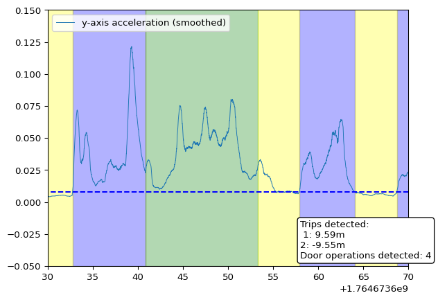

# Calcolo automatico dei parametri

:::: {.cell execution_count="1"}
::: {.cell-output .cell-output-stdout}
    Impossible to load package redis
:::
::::

## Introduzione

Questo documento descrive i principali parametri utilizzati per
caratterizzare un ascensore e rilevare i suoi eventi operativi a partire
dai segnali di accelerazione. Questi parametri permettono a un oggetto
`Record` di identificare correttamente **le corse** (spostamenti tra
piani) e **le operazioni delle porte** sulla base delle caratteristiche
estratte dalle accelerazioni verticali e orizzontali.

------------------------------------------------------------------------

## Parametri

Ogni ascensore può essere caratterizzato da un insieme di parametri.
Questi parametri devono essere forniti a un `Record` per identificare
correttamente le corse e le operazioni delle porte.

### `min_z_peak`

**Unità:** $\frac{m}{s^2}$

Se l'accelerazione verticale (smussata) supera questo valore, significa
che l'ascensore sta accelerando o decelerando. Dopo aver individuato
questi picchi, l'inizio e la fine di una corsa vengono determinati
utilizzando un metodo descritto in `missing reference`.

------------------------------------------------------------------------

### `min_door_len`

**Unità:** $s$

Durata minima di un'operazione della porta.

Tutte le vibrazioni che superano la soglia di ampiezza richiesta ma
durano meno di `min_door_len` vengono scartate.

------------------------------------------------------------------------

### `doors_threshold`

**Unità:** $\frac{m}{s^2}$

Ampiezza minima dell'accelerazione orizzontale dopo il preprocessing
(valore assoluto e smoothing).

------------------------------------------------------------------------

### `mean_acc_z`

**Unità:** $\frac{m}{s^2}$

Valore medio dell'accelerazione verticale. Idealmente dovrebbe essere
uguale all'accelerazione gravitazionale terrestre.

È necessario per l'elaborazione successiva del segnale, poiché deve
essere sottratto per far oscillare il segnale attorno allo zero.

------------------------------------------------------------------------

# Metodi di Calcolo

## `min_z_peak`

L'ipotesi alla base del calcolo è che le vibrazioni possano essere
suddivise in tre classi principali:

-   Oscillazioni vicine allo zero (rumore di fondo)
-   Altre vibrazioni distinguibili (ad esempio apertura delle porte)
-   Picchi durante accelerazione e decelerazione
-   Tutte le classi precedenti ma con segno negativo

Queste classi vengono identificate utilizzando l'algoritmo di
**clusterizzazione k-means**.

Il valore `min_z_peak` viene determinato prendendo una frazione sicura
della media del cluster con i valori più alti. Attualmente è impostato
al **75% della media del cluster**.

------------------------------------------------------------------------

## `min_door_len`

Questo parametro è calcolato come la **durata media di tutti gli
intervalli** in cui l'accelerazione orizzontale supera la soglia
`doors_threshold`.

------------------------------------------------------------------------

## `doors_threshold`

Il suo calcolo si basa sulle vibrazioni orizzontali.

Prima il segnale viene trasformato prendendo il **valore assoluto** e
applicando uno **smoothing con media mobile**. Se il segnale supera la
soglia per almeno `min_door_len` secondi, quel segmento del segnale
viene considerato come **un'operazione della porta**.

La soglia viene calcolata utilizzando la media e la deviazione standard
del segnale smussato:

``` python
doors_threshold = np.mean(self.y_smooth) + 0.25 * self.std_y_smooth
```

Un esempio del segnale smussato durante l'apertura di una porta è
mostrato nella figura seguente (in blu). La soglia è rappresentata dalla
linea tratteggiata.

:::: {.cell execution_count="2"}
::: {.cell-output .cell-output-display}

:::
::::

## Audit log
| Data | Utente | Descrizione |
|----------|----------|----------|
| 16.03.2026 | Radosław Lech | First version |
